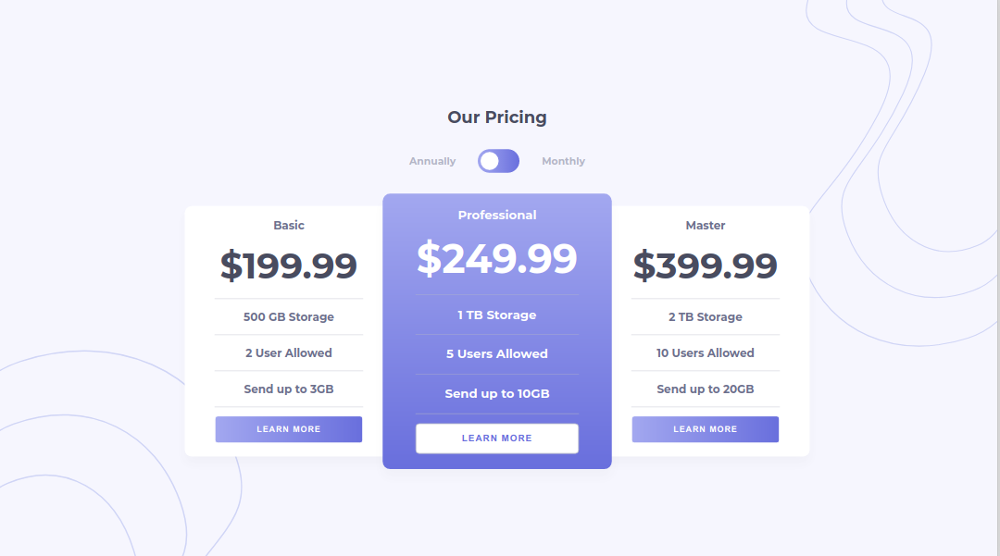

# Frontend Mentor - Pricing component with toggle solution

This is a solution to the [Pricing component with toggle challenge on Frontend Mentor](https://www.frontendmentor.io/challenges/pricing-component-with-toggle-8vPwRMIC). Frontend Mentor challenges help you improve your coding skills by building realistic projects.

## Table of contents

-   [Overview](#overview)
    -   [The challenge](#the-challenge)
    -   [Screenshot](#screenshot)
    -   [Links](#links)
-   [My process](#my-process)
    -   [Built with](#built-with)
    -   [What I learned](#what-i-learned)
    -   [Continued development](#continued-development)
    -   [Useful resources](#useful-resources)
-   [Author](#author)
-   [Acknowledgments](#acknowledgments)

## Overview

### The challenge

Users should be able to:

-   View the optimal layout for the component depending on their device's screen size
-   Control the toggle with both their mouse/trackpad and their keyboard
-   **Bonus**: Complete the challenge with just HTML and CSS

### Screenshot

### Links

-   Solution URL: [https://www.frontendmentor.io/solutions/price-table-with-toggle-using-html-css-and-javascript-yX4xuXsUc](https://www.frontendmentor.io/solutions/price-table-with-toggle-using-html-css-and-javascript-yX4xuXsUc)
-   Live Site URL: [https://ameyadeokule.github.io/price-table-toggle/](https://ameyadeokule.github.io/price-table-toggle/)

## My process

### Built with

-   Semantic HTML5 markup
-   CSS custom properties
-   Flexbox
-   Mobile-first workflow

### What I learned

-   To use checkbox to as a toggle between classes.

### Continued development

-   Use only CSS to do the slider effect with changes
-   Redo the project in ReactJS with Material UI

### Useful resources

-   [A Complete Guide to Flexbox](https://css-tricks.com/snippets/css/a-guide-to-flexbox/) - This section helped me in better understanding flexbox and how the arrangements world.

-   [The “Checkbox Hack”](https://css-tricks.com/the-checkbox-hack/#:~:text=Push%20Toggles,Like%20emoji%20toggles!) - This article explains with examples how to use checkbox as toggles between multiple pages and elements.

-   [A Complete Guide to CSS Media Queries](https://css-tricks.com/a-complete-guide-to-css-media-queries/) - This is an amazing article which helped me finally understand breakpoints and how to handle HTML elements on a much smaller screen using CSS media queries.

## Author

-   Name - [Ameya Deokule]
-   Frontend Mentor - [@ameyadeokule](https://www.frontendmentor.io/profile/ameyadeokule)

## Acknowledgments

I would like thank Kethmar Salumets [@developerhabits](https://twitter.com/developerHabits) for encouraging me to start completing challenges on Frontend Mentor.
